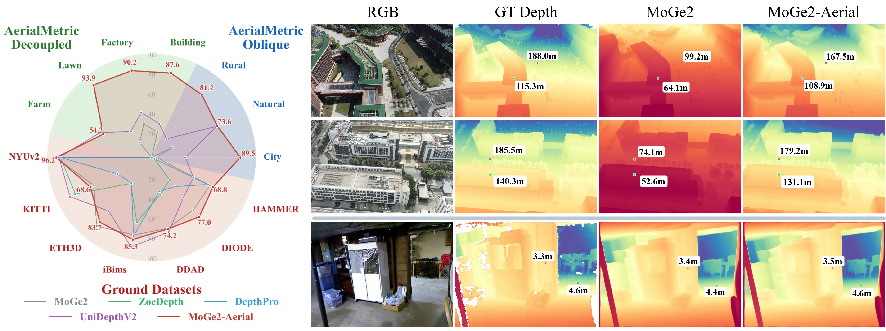

<div align="center">
  
# AerialMetric: Benchmarking and Adapting UAV Monocular Metric Depth Estimation in the Real World

[](https://kuieless.github.io/AerialMetric-ECCV2026-page/)
[](https://huggingface.co/datasets/Kuiee/AerialMetric-ECCV2026)

**[Zhongqiang Song](https://kuieless.github.io/Kuie-s-Academic-Pages/)<sup>1</sup> &nbsp;&nbsp; [Guanying Chen](https://guanyingc.github.io/)<sup>1,✉</sup> &nbsp;&nbsp; [Yuqi Zhang](https://zyqz97.github.io/)<sup>2,3</sup> &nbsp;&nbsp; Yin Zou<sup>1</sup>**

**[Chuanyu Fu](https://fcyycf.github.io/)<sup>1</sup> &nbsp;&nbsp; Zhiyuan Yuan<sup>1</sup> &nbsp;&nbsp; [Chuan Huang](https://scholar.google.com/citations?user=ei4jR4IAAAAJ&hl=en)<sup>4,2</sup> &nbsp;&nbsp; [Shuguang Cui](https://scholar.google.com.hk/citations?user=1o_qvR0AAAAJ&hl=en)<sup>3,2</sup> &nbsp;&nbsp; [Xiaochun Cao](https://scholar.google.com/citations?user=PDgp6OkAAAAJ&hl=en)<sup>1</sup>**

<br>

<sup>1</sup> Sun Yat-sen University, Shenzhen Campus &nbsp;&nbsp;&nbsp;&nbsp;
<sup>2</sup> FNii-Shenzhen &nbsp;&nbsp;&nbsp;&nbsp;
<sup>3</sup> SSE, CUHKSZ &nbsp;&nbsp;&nbsp;&nbsp;
<sup>4</sup> SIAS, USTC


<p align="center">
  
</p>

<p align="center">
  <em>AerialMetric is a real-world UAV monocular metric depth benchmark covering oblique photogrammetry, controlled aerial variables, in-the-wild UAV videos, and adapted MoGe-2 baselines.</em>
</p>
</div>

## News

✅ 26-7-24：The code repository is now publicly available and includes both inference and benchmark scripts.


## Benchmark Entry Points

```bash
cd /path/to/AerialMetric
```

The repository is organized into three benchmark interfaces:

| Directory | Purpose |
|---|---|
| `MoGe/` | Aerial benchmark for MoGe2 and AerialMetric  |
| `Ground_MoGe/` | Ground benchmark for MoGe2 and AerialMetric |
| `Depth_Baselines/` | Ground benchmark wrappers for UniDepth, DepthPro, and ZoeDepth |

Dataset layout requirements are documented in `DATA_ORGANIZATION.md`.

## Datasets & Weights
<p align="center">
  <table>
    <tr>
      <td width="50%" align="center">
        
      </td>
      <td width="50%" align="center">
        
      </td>
    </tr>
    <tr>
      <td align="center">
        <em>Pipeline of AerialMetric.</em>
      </td>
      <td align="center">
        <em>Dataset composition of AerialMetric.</em>
      </td>
    </tr>
  </table>
</p>

| Resource | Link |
|---|---|
| Dataset & Weights | [Kuiee/AerialMetric-ECCV2026](https://huggingface.co/datasets/Kuiee/AerialMetric-ECCV2026) |

## Environment Setup

```bash
conda create -n mogefresh3 python=3.10 -y
conda activate mogefresh3
pip install torch torchvision --index-url https://download.pytorch.org/whl/cu124
pip install -r requirements.txt
pip install -e MoGe/
```

Verify:

```bash
python -c "import torch; print(f'PyTorch {torch.__version__}, CUDA: {torch.cuda.is_available()}')"
python -c "from moge.model.v2 import MoGeModel; print('MoGe OK')"
```

## Reproduction

Edit paths in `benchmark.sh` to match your local setup, then run:

```bash
# 4 GPUs in parallel (recommended)
bash benchmark.sh 0,1,2,3

# Single GPU
bash benchmark.sh 0
```

The script runs all experiments automatically:


| Type          | Experiment | Datasets                    | Intrinsics             | Mask | Models                       |
| ------------- | ---------: | --------------------------- | ---------------------- | ---- | ---------------------------- |
| Aerial Scenes |          1 | Decoupled + Oblique + Wild  | none                   | load | Baseline + MoGe2-Aerial LoRA |
| Aerial Scenes |          2 | Decoupled + Oblique (norm)  | load                   | load | Baseline + MoGe2-Aerial LoRA |
| Ground Scenes |          3 | Ground ×7 (NYUv2, KITTI, …) | no oracle              | —    | Baseline + MoGe2-Aerial LoRA |
| Ground Scenes |          4 | Ground ×7                   | oracle (GT intrinsics) | —    | Baseline + MoGe2-Aerial LoRA |


Results are saved to `OUTPUT_ROOT` (default: `/data1/szq/622-freash3`) with per-dataset evaluation reports (`.txt` / `.json`).

Weights:
- MoGe2(Baseline): [MoGe-2 ViT-Large](https://huggingface.co/Ruicheng/moge-2-vitl-normal)
- MoG2-Aerial(LoRA Type): [AerialMetric-ECCV2026](https://huggingface.co/datasets/Kuiee/AerialMetric-ECCV2026)

Dataset layout: see `DATA_ORGANIZATION.md`. Ground config: edit `Ground_MoGe/configs/eval/ground_metric_benchmarks_local.json`.

## Quick Demo — Single Image / Video / Folder Inference

```bash
# Base model (single image)
python demo_infer.py \
  --input photo.jpg \
  --model vitl \
  --checkpoint /path/to/vitl-normal.pt \
  --output ./demo_output

# Aerial LoRA model (video, every 5th frame)
python demo_infer.py \
  --input video.mp4 \
  --model lora \
  --checkpoint /path/to/Moge2-Aerial.pt \
  --lora_config MoGe/configs/Final_train/config-lora-all.json \
  --output ./demo_output \
  --stride 5

# Full options example
python demo_infer.py \
  --input ./images/ \
  --model lora \
  --checkpoint /path/to/Moge2-Aerial.pt \
  --lora_config MoGe/configs/Final_train/config-lora-all.json \
  --output ./demo_output \
  --resize 1024 \
  --resolution_level 9 \
  --cmap inferno \
  --save_components
```

### CLI Reference

| Category | Argument | Default | Description |
|---|---|---|---|
| **Required** | `--input` | — | Image / video / folder path |
| | `--model` | — | `vitl` (base) or `lora` (LoRA fine-tuned) |
| | `--checkpoint` | — | Path to `.pt` checkpoint |
| **LoRA** | `--lora_config` | — | LoRA config JSON (required for `--model lora`) |
| | `--lora_rank` | 96 | LoRA rank |
| **Inference** | `--resize` | 0 | Long-edge resize target (0=original). Padded to ×14 |
| | `--resolution_level` | 9 | MoGe2 quality/speed: 0 (fastest) ~ 9 (best) |
| | `--force_projection` | on | Recompute point map from depth for consistency |
| | `--apply_mask` | on | Mask invalid depth regions |
| | `--fov_x` | auto | Override horizontal FoV (degrees), auto-estimate if omitted |
| | `--device` | cuda | `cuda` / `cpu` |
| | `--fp16` / `--no_fp16` | on | FP16 inference |
| **Output** | `--output` | `./demo_output` | Output directory |
| | `--save_npy` / `--no_npy` | on | Save raw `.npy` depth array |
| | `--save_components` | off | Also save standalone `_depth_vis.png` |
| **Visualization** | `--cmap` | jet | Colormap: `jet` / `inferno` / `plasma` / `viridis` / `turbo` |
| | `--vmin` / `--vmax` | auto | Depth range clamp for colormap |
| | `--seed` | 42 | Random seed for point picking |
| | `--point_margin` | 20 | Edge margin for point sampling |
| **Video** | `--stride` | 1 | Process every N-th frame |

### Output per frame

| File | Description |
|---|---|
| `*_depth.npy` | Raw float32 depth array |
| `*_depth_annotated.png` | **Composite**: depth colormap + 2 random point depth markers + colorbar |
| `*_colorbar.png` | Standalone depth scale bar |
| `*_meta.json` | Per-frame metadata (see below) |


Weights:
- MoGe2(Baseline): [MoGe-2 ViT-Large](https://huggingface.co/Ruicheng/moge-2-vitl-normal)
- MoG2-Aerial(LoRA Type): [AerialMetric-ECCV2026](https://huggingface.co/datasets/Kuiee/AerialMetric-ECCV2026)


## Acknowledgments

### Models & Tools

- **[MoGe-2](https://github.com/microsoft/MoGe)** (Wang et al., 2025) — the core monocular geometry estimation model.

### Oblique：Data Sources

We gratefully acknowledge the following datasets or works for providing raw UAV imagery, scene assets

- **[GauU-Scene](https://saliteta.github.io/CUHKSZ_SMBU/)** — large-scale UAV aerial scene dataset.
- **[UrbanBIS](https://vcc.tech/UrbanBIS)** (Yang et al., SIGGRAPH 2023) — benchmark for fine-grained urban building instance segmentation.
- **[UrbanScene3D](https://vcc.tech/UrbanScene3D/)** (Lin et al., ECCV 2022) — large-scale urban scene dataset with high-resolution aerial images.
- **[UAVScenes](https://github.com/sijieaaa/UAVScenes)** (Wang et al., ICCV 2025) — multi-modal UAV dataset with frame-wise semantic annotations.
- **[OpenDroneMap](https://opendronemap.org/odm/datasets/)** — open-source toolkit for generating maps, point clouds, 3D models, and DEMs from drone images.
- **[ArcGIS Drone2Map](https://www.esri.com/zh-cn/arcgis/products/arcgis-reality/resources/sample-drone-datasets)** (ESRI) — create 3D products from drone imagery.

## Citation

If you find this work useful, please cite:

```bibtex
@inproceedings{song2026aerialmetric,
  title     = {AerialMetric: Benchmarking and Adapting UAV Monocular Metric Depth Estimation in the Real World},
  author    = {Zhongqiang Song and Guanying Chen and Yuqi Zhang and Yin Zou and Chuanyu Fu and Zhiyuan Yuan and Chuan Huang and Shuguang Cui and Xiaochun Cao},
  booktitle = {European Conference on Computer Vision (ECCV)},
  year      = {2026}
}
```

# Website License
<a rel="license" href="http://creativecommons.org/licenses/by-sa/4.0/"></a><br />This work is licensed under a <a rel="license" href="http://creativecommons.org/licenses/by-sa/4.0/">Creative Commons Attribution-ShareAlike 4.0 International License</a>.
